# Amazon Review Sentiment as a Predictor of Economic Trends

## Repository Contents

This repository includes:
- Jupyter notebooks for all preprocessing, modeling, and analysis steps
- Final Report in PDF format
- Prior milestone submissions
- This README summarizing the full project workflow and files

## Environment Setup

Environment: miniconda

Used packages and libraries: Python ver. 3.10, Pyspark (Ver 4.0.0), re, os, pickle, glob, pyspark.sql, pyspark.ml, numpy, matplotlib, seaborn, json, gdown, pandas, wordclous, textblob, scipy.stats

## Dataset and Source

We use two primary datasets:

1. **Amazon Product Reviews**: Filtered by 4 product categories: Groceries, Baby Products, Toys & Games, Movies & TV.  
   Source: [https://s3.amazonaws.com/amazon-reviews-pds/tsv/index.txt](https://s3.amazonaws.com/amazon-reviews-pds/tsv/index.txt)

2. **U.S. GDP per Capita**: Yearly data from 1996 to 2023.  
   Source: World Bank and supplemental public datasets

## Notebook

Final model and data download can be found in the linked Jupyter Notebooks:

**[Amazon Reviews GDP Analysis](./Amazon_reviews_GDP_analysis.ipynb)** || 
**[Data Download](./Data_download.ipynb)**

## Final Report

The pdf version of the written report is available here:  
[**Amazon Review Sentiment as a Predictor of Economic Trends (PDF)**](./Amazon_Review_Sentiment_as_a_Predictor_of_Economic_Trends.pdf)

### Introduction

This project investigates whether consumer sentiment expressed in Amazon product reviews can serve as an early indicator of broader economic trends. By analyzing millions of reviews across diverse product categories using natural language processing (NLP), we aim to uncover patterns in tone, emotional intensity, and volume—particularly in price-sensitive categories such as groceries, baby products, toys, and media. These patterns are compared to key macroeconomic indicators, including inflation rates and consumer confidence indexes.

We hypothesize that online reviews, authored spontaneously by millions of individuals, may capture real-time fluctuations in public sentiment and financial behavior more quickly than traditional economic reporting. By aggregating sentiment features—such as polarity, subjectivity, and linguistic trends—on an annual basis, we assess whether collective consumer expression can reliably predict periods of economic growth or contraction.

If successful, this approach could offer economists, businesses, and policymakers a high-frequency, low-cost, crowd-sourced signal of economic sentiment—potentially preceding traditional metrics.

### Methods

Our modeling process followed a structured pipeline of data preprocessing, feature extraction, aggregation, transformation, and supervised learning using logistic regression. All modeling was conducted with attention to temporal structure, using chronological splits to prevent leakage.

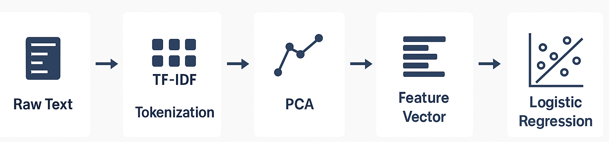
**Figure 1:** Overview of the modeling pipeline, showing major data transformation and modeling stages.

We used (1) Amazon review data filtered to four categories—Groceries, Baby Products, Toys & Games, and Movies & TV—and (2) U.S. GDP per capita data from 1996 to 2023. Reviews with 3-star ratings were excluded to sharpen sentiment signals. The remaining reviews included star ratings, text, category, and timestamps. GDP data was converted into binary labels: 1 for years with growth, 0 otherwise.

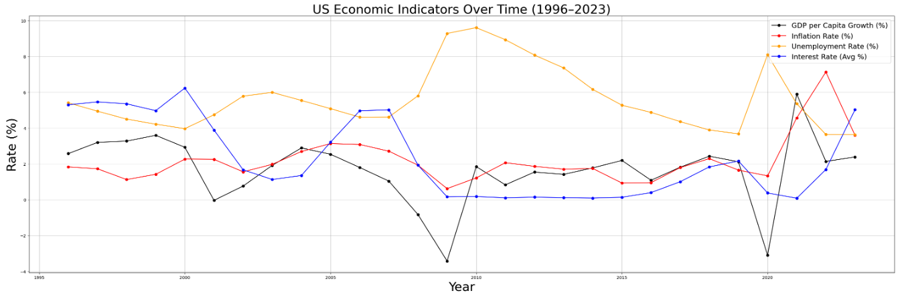  
**Figure 2:** Trends in key U.S. economic indicators between 1996 and 2023. GDP per capita growth (black) served as the basis for labeling each year as an economic upturn or downturn in our classification task. Additional indicators—such as inflation, unemployment, and interest rates—are shown for context but were not directly used as input features in the model.

#### Text and Sentiment Processing  

We implemented a PySpark NLP pipeline to transform review text into numeric representations. Reviews 
were tokenized, stop words were removed, and the resulting tokens were mapped into high-dimensional 
hashed term frequency vectors using the HashingTF function with 10,000 buckets. These frequency 
vectors were then scaled using inverse document frequency (IDF) weighting to emphasize rare but 
potentially informative terms. 

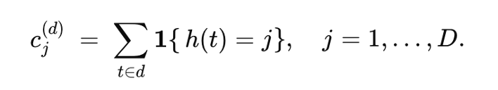  
**Figure 3:** Illustration of text transformation steps from raw reviews to TF-IDF vectors. 

In parallel, we performed sentiment scoring using TextBlob. Each review received a polarity score 
between –1 and +1, indicating its sentiment intensity. The polarity score was later combined with the 
TF-IDF representation to form a unified feature vector for each review. 
 
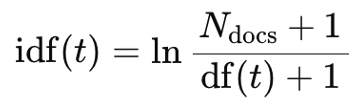  
**Figure 4:** Formula showing how polarity and TF-IDF vectors are concatenated into a final input vector. 

#### Aggregation by Year and Product Group

To align text and sentiment features with economic indicators, we aggregated data at the year and product 
category level. For each combination, we computed: 
- Mean sentiment polarity 
- Sentiment volatility (standard deviation) 
- Total review count 
- Mean TF-IDF vector 

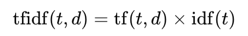  
**Figure 5:** Yearly aggregation process for sentiment and TF-IDF vectors across essential and luxury 
categories. 

These aggregated features were then pivoted so that each year contained two sets of features—one for 
essential and one for luxury products—enabling separate modeling of necessity- and discretion-based 
sentiment. 

#### Sentiment Statistics and Composite Features

The aggregated sentiment features were further processed to quantify changes in consumer tone and 
emotional volatility. For each year, the following sentiment features were created: 
- essential_avg_sentiment, essential_review_count, essential_volatility
- luxury_avg_sentiment, luxury_review_count, luxury_volatility
  
These statistics provided macro-style consumer behavior signals, which were then merged with GDP 
labels and TF-IDF features. 
 
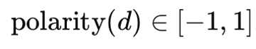  
**Figure 6:** Range of polarity values returned by TextBlob for review d 

We also calculated the sentiment difference between essential and luxury categories, allowing the model 
to learn contrasts in consumer confidence across economic necessity. 

#### Dimensionality Reduction

High-dimensional TF-IDF vectors were reduced via Principal Component Analysis (PCA), with 50 
components retained for each product category. This yielded 100 features per year, preserving variance 
while reducing sparsity and complexity. 

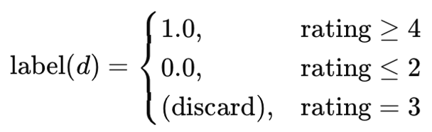  
**Figure 7:** Label assignment based on star ratings. Neutral reviews (3 stars) were discarded to emphasize 
clear sentiment signals. 

#### Year-Over-Year Feature Engineering 
Recognizing that raw sentiment levels may be confounded by product trends or seasonal effects, we 
computed delta-based features that captured year-to-year changes. Specifically, we calculated: 
- essential_sentiment_yoy_change
- luxury_sentiment_yoy_change
- sentiment_gap_yoy_change
  
These features quantify shifts in sentiment and emotional divergence between essential and luxury goods, 
which may better reflect economic momentum. 
 
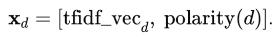  
**Figure 8:** Final review-level input vector composed of TF-IDF text features and a polarity score. 
Any  rows  missing  valid YOY differences were removed, reducing the usable dataset to 27 years 
(1997–2023), with 23 years used for training and 5 years for testing. 
 
### Model Setup and Feature Vector 

We created the final input feature vector by combining the three year-over-year sentiment features with 
the 100 PCA components. These features were standardized using StandardScaler to prevent uneven 
feature weighting due to scale differences. 
The binary label for each year indicated whether GDP per capita increased (1) or decreased/remained 
constant (0) compared to the prior year. 
 
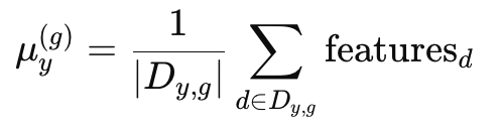  
**Figure 9:** Aggregation of review features for year y and group g (essential or luxury), averaged across all 
reviews in that group. 

#### Model Training and Evaluation 

We trained a logistic regression model with L1 regularization (elasticNetParam = 1.0, regParam = 0.01) 
using a chronological split: 1997–2018 for training, 2019–2023 for testing. This time-respecting strategy 
avoided leakage and preserved forecasting realism. Performance was measured using AUC and accuracy. 
 
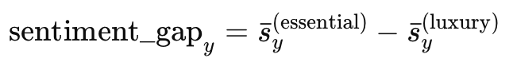  
**Figure 10:** Difference in average sentiment polarity between essential and luxury categories for year y. 
 
### Results

#### Data Exploration

Preliminary analysis of the Amazon review data revealed a highly polarized rating distribution. Most 
reviews clustered at 1, 4, or 5 stars, with a minimal presence of 3-star ratings—validating their exclusion 
from modeling. Review volume steadily increased over time, particularly after 2012, consistent with 
Amazon’s platform growth. Sentiment analysis showed that luxury product categories (e.g., Movies & 
TV)  exhibited  more  fluctuation  in  polarity  than  essential  categories  (e.g.,  Groceries),  suggesting 
heightened sensitivity to economic conditions in discretionary spending sectors. 
Notably, the year 2020 saw a pronounced drop in average sentiment polarity and a spike in polarity 
volatility across all categories, aligning with the COVID-19 pandemic. These disruptions hinted at a 
broader link between consumer sentiment and real-world economic stressors. 

#### Preprocessing and Feature Engineering 

TF-IDF vectors derived from review text were hashed into 262,144-dimensional representations and 
subsequently reduced to 50 principal components per product category using PCA. This dimensionality 
reduction maintained interpretability while reducing computational load and mitigating overfitting risks. 
In parallel, sentiment polarity scores were extracted using TextBlob and averaged across each year. 
To reflect directional sentiment shifts rather than static scores, year-over-year deltas were computed for 
each category's average sentiment and their inter-category sentiment gap. This aggregation produced a 
compact, interpretable dataset containing three engineered sentiment features and 100 PCA components 
per year. 

#### Model Performance 

The logistic regression model was trained on 23 years of data (1997–2018) and tested on the 5 most 
recent years (2019–2023). The model achieved: 
- Training Accuracy: 1.000, Training AUC: 1.000
- Test Accuracy: 0.800, Test AUC: 0.833 
 
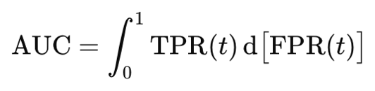  
**Figure 11:** Area under the ROC curve (AUC), calculated as the integral of the true positive 
rate (TPR) with respect to the false positive rate (FPR). 

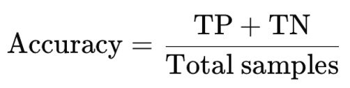  
**Figure 12:** Accuracy, defined as the ratio of correct predictions (true positives and true 
negatives) to the total number of test samples. 

The model correctly predicted key economic shifts, including the 2020 downturn, demonstrating its 
ability to align with actual GDP movement using only review-derived sentiment features. However, not 
all predictions were correct, and a 0.167 gap between training and test AUC signals some degree of 
overfitting. 
 
### Discussion 
The primary objective of this study was to assess whether machine learning models trained solely on 
Amazon review sentiment could predict U.S. economic upturns and downturns. Specifically, we explored 
whether aggregated consumer sentiment—captured through polarity scores and textual features—could 
serve as a timely, crowd-sourced indicator of macroeconomic conditions. 

Our dataset consisted of millions of reviews, from which we selected four product categories grouped into 
two economic segments: “essential” (Groceries and Baby Products) and “luxury” (Toys & Games and 
Movies & TV). This division was designed to probe whether discretionary spending patterns (luxury 
goods) responded differently to economic changes compared to necessity-driven purchases (essentials). 
Exploratory analysis supported this approach: luxury categories exhibited sharper fluctuations in rating 
distribution and sentiment polarity over time, while essential goods remained more stable. 
We retained four key fields from each review: the star rating, review text, timestamp, and product 
category. Reviews with neutral 3-star ratings were removed to focus the analysis on clearly positive or 
negative sentiment. TextBlob was used to assign polarity scores to each review, and Spark’s machine 
learning pipeline was employed to tokenize, filter, and vectorize the text using HashingTF and IDF. Each 
review was ultimately represented as a combined sentiment-text vector and assigned a binary label based 
on its star rating. 

To make the data suitable for time-series modeling, we aggregated features annually and by product 
group. For each year, we computed the average sentiment polarity, polarity volatility (standard deviation), 
review count, and mean TF-IDF vector for both luxury and essential reviews. Principal component 
analysis  (PCA)  reduced the TF-IDF vectors from over 260,000 dimensions to 50 components per 
category,  allowing  us  to  retain  the  most  meaningful  patterns  while  keeping  the  feature  space 
computationally manageable. 

We then calculated annual sentiment deltas—capturing year-over-year changes in average polarity for 
each category, as well as the change in the sentiment gap between them. These engineered features 
allowed our model to detect directional trends and momentum rather than static sentiment levels. This 
approach also aligned the feature timeline with GDP’s annual reporting structure, creating a consistent 
and interpretable economic time series. 

We labeled each year from 1997 to 2023 as either an upturn (GDP per capita increased) or downturn 
(GDP per capita decreased) using official economic data. The model was trained on data from 1997 to 
2018 and tested on data from 2019 to 2023, using a strict chronological split to preserve temporal 
structure. Randomized cross-validation was intentionally avoided after preliminary experiments showed it 
yielded poor performance (AUC ~0.58) due to temporal leakage—mixing past and future data disrupts 
time-dependent patterns, weakening the model’s ability to generalize in real-world forecasting scenarios. 
The  final  logistic  regression  model  achieved  perfect  training  accuracy and AUC (1.000) but still 
demonstrated strong generalization with 0.800 accuracy and 0.833 AUC on the test set. While the perfect 
training performance raises overfitting concerns, several factors suggest it may not be overly problematic. 

First, the model’s simplicity—using only three engineered sentiment features and PCA-compressed 
components—limits its capacity to memorize training data. Second, the strong test performance confirms 
the model’s ability to capture underlying patterns. Third, GDP trends may be linearly separable given the 
nature of the aggregated sentiment data, especially when annual differences are used. 
Nonetheless, the 0.167 drop in AUC from train to test is nontrivial. To address this, future work should 
consider incorporating additional regularization, exploring ensemble methods, or expanding the feature 
set  to  include  other  metadata  (e.g.,  verified  purchase  flags,  helpful  vote  counts,  review  length). 
Additionally, using non-linear classifiers like Random Forests or XGBoost may help capture interactions 
that logistic regression misses. 

There are also notable limitations. Although our dataset contains millions of reviews, the number of 
training samples is small—only 27 years of data are available. Amazon was founded in 1995, and reviews 
only became sufficiently populated after 2012, limiting the statistical depth of our modeling. Furthermore, 
we analyzed only four product categories. A more granular sectoral breakdown—such as electronics, 
apparel, or household goods—might uncover more targeted signals tied to economic activity. 
Beyond modeling improvements, another key direction is increasing temporal granularity. By aggregating 
reviews on a quarterly or monthly basis, we could produce more frequent predictions and potentially 
improve alignment with short-term economic changes. This would also yield more training examples, 
increasing  statistical  robustness.  Integrating  sentiment-based  predictors  with  traditional  economic 
indicators such as unemployment, inflation, or consumer confidence indices may also enhance forecasting 
accuracy through ensemble approaches. 

Finally, one long-term goal is to enable real-time economic tracking using live review data. If consumer 
sentiment trends can be captured continuously, models like ours could serve as low-latency complements 
to  government-released  economic  statistics—offering  early  warnings  for  economic shifts based on 
spontaneous consumer expression. 
 
### Conclusion 

This study demonstrates that combining sentiment metrics with TF-IDF-based text features from Amazon 
reviews can provide predictive signals for distinguishing between years of U.S. economic expansion and 
recession. By aggregating consumer sentiment across both essential and luxury product categories, and 
focusing on year-over-year changes rather than absolute values, we were able to extract meaningful 
macro-level trends from millions of micro-level interactions. 

The final logistic regression model achieved perfect training performance (AUC = 1.000, Accuracy = 
1.000), but somewhat lower performance on the test set (AUC = 0.833, Accuracy = 0.800). This gap 
indicates potential overfitting, suggesting that while the model successfully captured patterns in the 
training data, its generalization to future, unseen years is limited. 

Nevertheless, the strong test results affirm that sentiment data—when properly engineered and temporally 
structured—can offer valuable insight into broader economic patterns. The model’s success in forecasting 
the  2020  economic  downturn,  which  aligns  with  COVID-19  disruptions,  provides  a  particularly 
compelling proof of concept. 

To  enhance  robustness  and  predictive  reliability,  future  work  should  explore  more  aggressive 
regularization  (e.g.,  increasing  regParam  or  tuning  elasticNetParam), expanding the feature set, or 
combining  sentiment  indicators  with  traditional  economic  variables  in  an  ensemble  framework. 
Additionally, while our study was constrained to annual granularity, transitioning to quarterly or even 
monthly analysis could improve temporal resolution and lead to more timely economic forecasts. 
Overall, while this sentiment-driven model is not yet a substitute for formal economic forecasting 
methods, it opens the door to lightweight, scalable tools that tap into real-time consumer behavior for 
early signals of economic shifts. 

### Contributions

-**Ann Nguyen**:  
-**Artien Voskanian**:  
-**Joanna Tam**:  
-**Matthew Mitchell**: GitHub management (hosting the repo, uploading files, and merging branches), README writing (original Module 2 and 3 submissions as well as the final submission), and Final Report Writing (namely Introduction, Method, and Results sections)

## Prior Submissions

- **[Amazon_reviews_exploration.ipynb](./Amazon_reviews_exploration.ipynb)** – Initial data exploration and preprocessing pipeline
- **[Milestone_3.ipynb](./Milestone_3.ipynb)** – First model development
